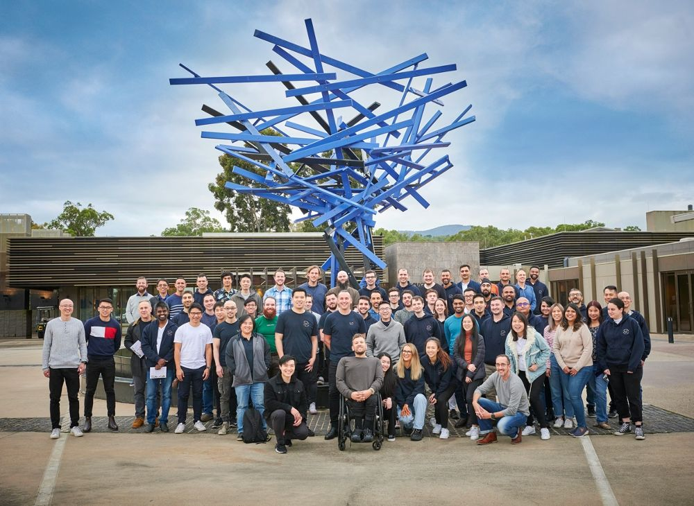

# Lexicon Digital - Associate to Consultant pathway

At Lexicon Digital, we value learning and growth for all of our team members. We have created this pathway to guide our associates to develop their skills and go on their way to becoming well-rounded consultants. The material presented below are from a combination of sources, such as YouTube, learning platforms, and specific courses. For access to the learning platforms and specific courses, please refer to the instructions found [here](https://sites.google.com/lexicondigital.com.au/portal/growth#h.raerll82acn)

## Table of Contents

- [Focus areas](#focus-areas)
    - [Core fundamentals](#core-fundamentals)
    - [Software development](#software-development)
    - [Software Architecture](#software-architecture)
    - [DevOps](#devops)
    - [Cloud Computing](#cloud-computing)
- [Recommended certifications](#recommended-certifications)
- [Available learning platforms](#learning-platforms)
    - [Requesting additional training](#requesting-additional-training)
- [Reporting Bugs and Issues](#reporting-issues)
- [Contributing](#contributing)

## Focus areas 

Below are five key areas for developing your skills and becoming a well-rounded consultant at Lexicon Digital. We recommend working your way through each of the categories as numbered. Once you have completed covering the key areas you may wish to watch previous [Tech Guild workshops](https://drive.google.com/drive/folders/1xfa4xo-bxvMPUtyBR6DzbMSceaiQ7ODS) we have run in the past.

### 1. Core fundamentals 

##### The core fundamentals listed below are key topics and areas that every software engineer should have as they develop their career.
 

-  [Computer Stuff They Didn't Teach You (playlist)](https://www.youtube.com/playlist?list=PL0M0zPgJ3HSesuPIObeUVQNbKqlw5U2Vr)
-  [Common terminal commands](https://www.youtube.com/watch?v=ZtqBQ68cfJc)
-  [Test driven development using javascript](https://www.udemy.com/course/test-driven-development-using-javascript-and-jest/)
-  [Design Patterns in JavaScript](https://www.udemy.com/course/design-patterns-javascript/)
-  [Software Architecture and Clean Code Design in OOP](https://www.udemy.com/course/software-architecture-learnit/)
-  [Object-oriented Programming in JavaScript](https://www.youtube.com/watch?v=PFmuCDHHpwk)

### 2. Software development 
*Within this category we recommend undertaking one of the Typescript courses below if you are unfamiliar with it. The remainder of the courses are optional and may be beneficial to you depending on a client's tech stack.*
 

- [TypeScript crash course](https://www.youtube.com/watch?v=BwuLxPH8IDs)
OR [Understanding TypeScript](https://www.udemy.com/course/understanding-typescript/)

##### The language specific courses below are based on your past knowledge and upcoming client projects.
- [The Complete JavaScript Course](https://www.udemy.com/course/the-complete-javascript-course/)
- [Complete Kotlin development masterclass](https://www.udemy.com/course/kotlinmasterclass/)
- [Kotlin Koans Challenges](https://kotlinlang.org/docs/koans.html)

###### Paid courses (please speak to your mentor to request a license):
- [Epic React](https://epicreact.dev/)
- [CSS for JavaScript Developers](https://css-for-js.dev/)

### 3. Software Architecture 
- [Breaking Dependencies: The SOLID Principles](https://www.youtube.com/watch?v=RT-npV1JRKE)
- [Domain Driven Design & Microservices](https://www.youtube.com/watch?v=Km1fZ108UXU)
#### Additional Courses
- [gRPC MasterClass: Build Modern API & Microservices](https://www.udemy.com/course/grpc-nodejs/) (available in NodeJS, Java & Go)
- [Event-Driven Microservices: Spring Boot, Kafka and Elastic](https://www.udemy.com/course/event-driven-microservices-spring-boot-kafka-and-elasticsearch/)
- [Microfrontends with React](https://www.udemy.com/course/microfrontend-course/)
### 4. DevOps 

- [Intro to DevOps Engineering](https://www.youtube.com/watch?v=j5Zsa_eOXeY)
- [DevOps Prerequisites course](https://www.youtube.com/watch?v=Wvf0mBNGjXY)
- [Introduction to Continuous Integration & Continuous Delivery](https://www.udemy.com/course/introduction-to-continuous-integration-and-continuous-delivery/)

#### Additional Courses

- [Docker for the Absolute Beginner - Hands On - DevOps](https://www.udemy.com/course/learn-docker/)
- [Linux Bootcamp: Go from Beginner to Advanced](https://www.udemy.com/course/linux-administration-bootcamp/)

### 5. Cloud Computing 

- [FreeCode Camp - AWS Certified Cloud Practitioner](https://www.youtube.com/watch?v=SOTamWNgDKc)

- [Intro to AWS Cloud Computing](https://www.youtube.com/watch?v=ZE139jQJpW4&list=PLzde74P_a04cyCsmZakYbUE5sWN9dZ-Ux)

Additional resources for cloud computing can be found in the **cloud** OR **a-cloud-workshop** directories.
 

## Recommended certifications 
 
There are many certifications available to software engineers. Below are some of the few we strongly recommend as your start your journey:
 
 

#### **AWS**

Amazon Web Services (AWS) is the world’s most comprehensive and broadly adopted cloud platform, followed by Microsoft Azure and Google Cloud Platform (GCP). Having an understanding in some cloud computing basics is highly valuable as most companies have transitioned or are on their way to using cloud computing infrastructure as opposed to on-premises hardware.
- [AWS Certified Cloud Practitioner](https://aws.amazon.com/certification/certified-cloud-practitioner/)
- [AWS Solutions Architect (Associate)](https://aws.amazon.com/certification/certified-solutions-architect-associate/)

A collection of starting resources have been discussed [here](https://lexicondigital.slack.com/archives/CE9G6QM8B/p1636002899061500?thread_ts=1636002762.061300&cid=CE9G6QM8B) within the Lexicon slack workspace.
 

#### **Linux**

The Linux kernel and subsystems are key to software development as the vast majority of containers, servers and Virtual Machines (VM's) will use some form of linux as a base system. Having a brief understanding of commands and scripting in this can be highly beneficial. 
- [Introduction to Linux](https://training.linuxfoundation.org/training/introduction-to-linux/)
 

## Available learning platforms 

Below are some of the learning platforms available to you - login credentials can be found within the company [portal](https://sites.google.com/lexicondigital.com.au/portal/home).

- [FreeCode Camp](https://www.freecodecamp.org/learn) (no logins needed)
- [A Cloud Guru](https://acloudguru.com/)
- [Udemy](https://www.udemy.com/)

If you have recommendations for additional learning platforms or resources please feel free to speak with your mentor, one of the people and experience team members or raise them in the #devtech channel in slack.

### Requesting additional training 

Some training materials and courses such as the Epic React course mentioned above can be provided to you through your mentor's recommendation. If you feel that you may benefit from additional courses please speak to your mentor and they can arrange for it to be purchased or re-imbursed back to you.

## Reporting Bugs and Issues 

If you experience any issues with company logins or course material not being available, please let the operations team know as soon as possible.

## Contributing 

If any content above has been updated or removed from their sources please feel free to update this document by raising a merge request with the relevant changes.

We are always looking for ways to improve and ensure that we are providing up to date learning opportunities for all our team members at Lexicon Digital. If you feel that this guide can be improved with new content or additional topics please reach out to your mentor and raise a merge request into the ./admin/suggestions.md file.
